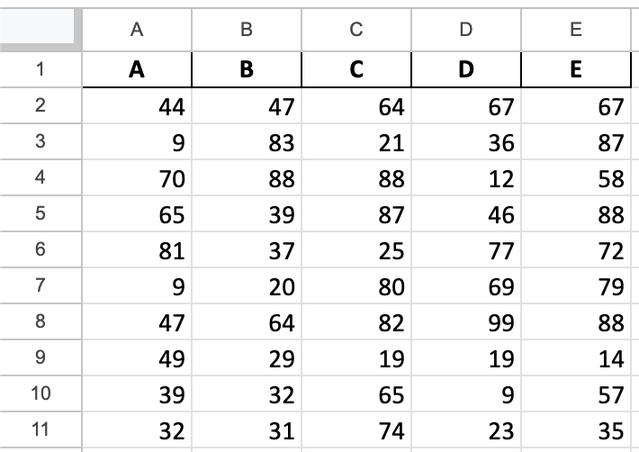
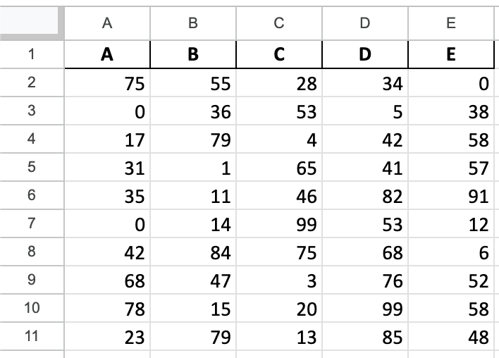
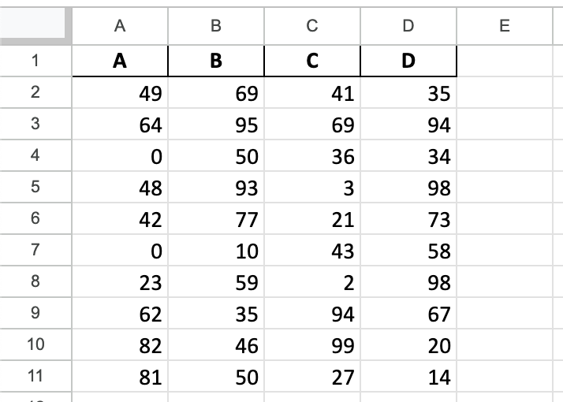
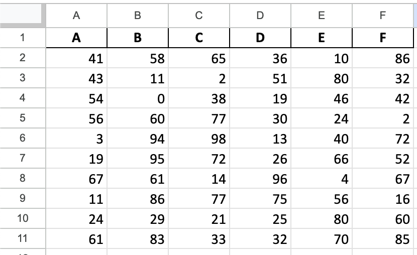
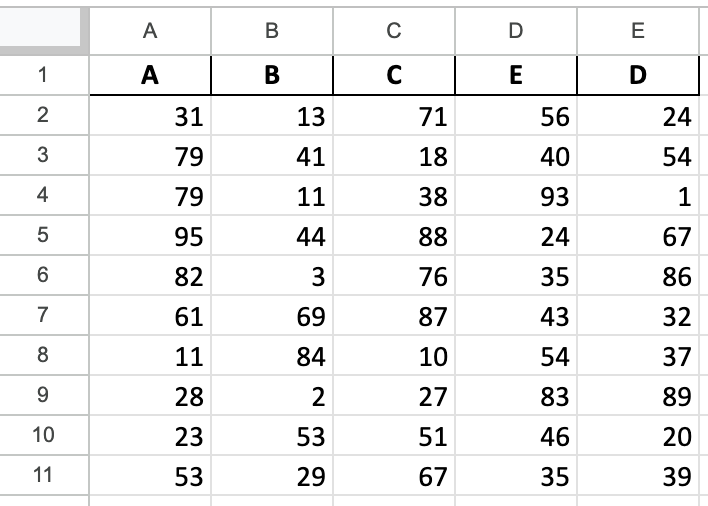
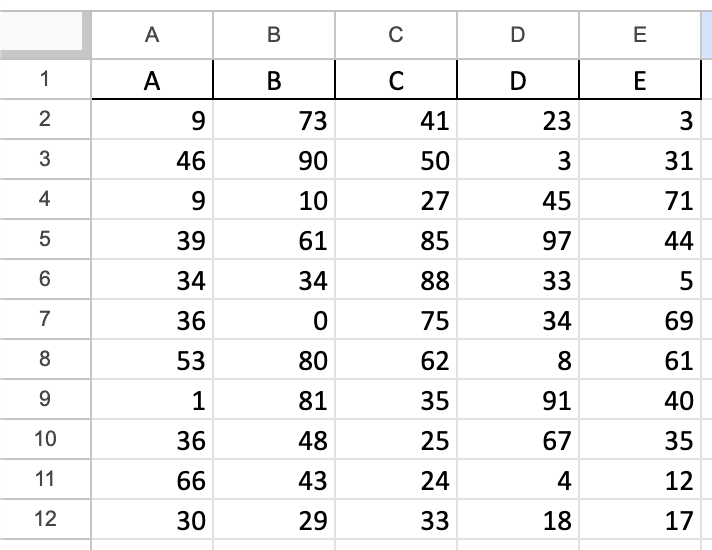
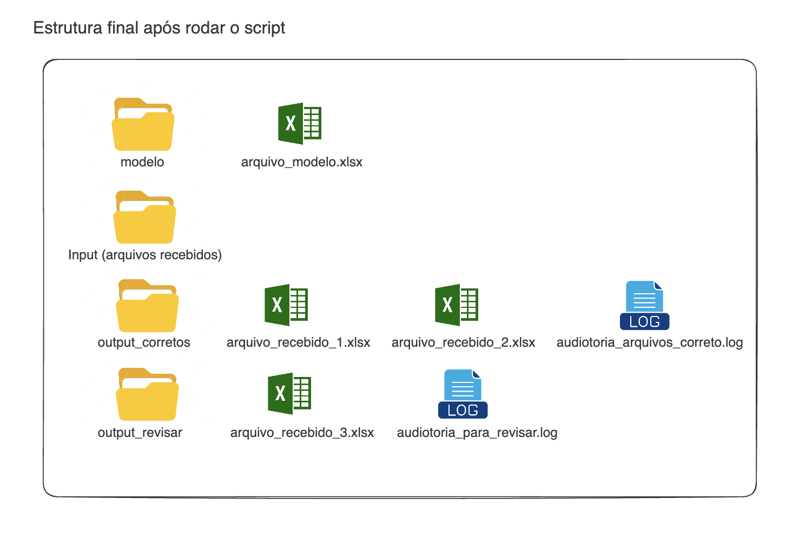

# Excel Structure Validator

## Descrição

O Excel Structure Validator é um projeto Python destinado a validar a estrutura de arquivos Excel. Ele compara arquivos Excel recebidos com um modelo pré-definido para assegurar que os dados cumpram com os padrões estabelecidos. O projeto é ideal para cenários onde a qualidade e a consistência dos dados são críticas para análises subsequentes, como importações para o Power BI, análises de dados, entre outros.

Antes de iniciar avalie os arquivos em excel dentro da pasta data/input e data/modelo para entender o comportamento do projeto. Para facilitar, criei arquivos simples com 4 até 6 colunas e poucas linhas, porém o conceito se aplica a qualquer modelo e/ou quantidade de colunas/linhas.

## Funcionalidades

* Valida a quantidade de linhas
* Verifica a existência de colunas a mais ou a menos
* Compara a ordem das colunas com o arquivo modelo
* Valida os tipos de dados das colunas

### Modelo

O arquivo modelo é o arquivo Excel que deve seguir como template. Ele contém a estrutura que os arquivos Excel recebidos devem seguir. Ele deve ser colocado no diretório `data/modelo/`.



### Arquivo 1

O arquivo 1 é um arquivo Excel que contém a estrutura correta.


### Arquivo 2

O arquivo 2 é um arquivo Excel que contém a estrutura incorreta, apresenta uma coluna a menos.


### Arquivo 3

O arquivo 3 é um arquivo Excel que contém a estrutura incorreta, apresenta uma coluna a mais, coluna f.


### Arquivo 4

O arquivo 4 é um arquivo Excel que contém a estrutura incorreta, a ordem das colunas está diferente.


### Arquivo 5

O arquivo 5 é um arquivo Excel que contém a estrutura incorreta, o número de linhas está diferente. A linha 12 foi adicionada.



### Antes de rodar o script


### Depois de rodar o script e com o resultado da auditoria



## Requisitos

* Python 3.x
* Pandas
* Loguru
* Poetry (opcional)

## Instalação

### Usando pip

1. Clone este repositório
    
2. Navegue até o diretório do projeto e instale as dependências usando pip:
    
    ```bash
    pip install -r requirements.txt
    ```
    

### Usando Poetry (Opcional)

1. Clone este repositório
    
2. Navegue até o diretório do projeto e instale as dependências usando poetry:
    
```bash
poetry install
```
    

Para ativar o ambiente virtual do projeto:

```go
poetry shell
```

## Estrutura do Projeto

```bash
├── README.md
├── app
│   ├── __init__.py
│   ├── config.py
│   ├── pipeline.py
│   └── validacoes
│       ├── __init__.py
│       ├── colunas_estao_presentes.py
│       ├── colunas_estao_presentes_na_mesma_ordem.py
│       ├── existem_colunas_a_mais.py
│       ├── existem_colunas_a_menos.py
│       ├── quantidade_de_linhas.py
│       └── tipos_dados.py
├── data
│   ├── input
│   │   ├── arquivo_recebido_1.xlsx
│   │   ├── arquivo_recebido_2.xlsx
│   │   ├── arquivo_recebido_3.xlsx
│   │   ├── arquivo_recebido_4.xlsx
│   │   └── arquivo_recebido_5.xlsx
│   ├── modelo
│   │   └── arquivo_modelo.xlsx
│   ├── output_corretos
│   └── output_revisar
├── docs
│   └── index.md
├── mkdocs.yml
├── poetry.lock
├── pyproject.toml
├── requirements.txt
``````

## Uso

1. Coloque o arquivo modelo Excel em `data/modelo/`
    
2. Coloque os arquivos Excel que você deseja validar em `data/input/`
    
3. Execute o script `pipeline.py` para iniciar o processo de validação:
    
    ```bash
    python3 -m app.pipeline
    ```

    ou se você estiver usando Poetry:

    ```bash
    task run
    ```
    
4. Verifique os logs e os arquivos Excel movidos para os diretórios `output_corretos` ou `output_revisar`.
    

## Logs

Os logs são gerados para cada arquivo e são armazenados no mesmo diretório de destino dos arquivos Excel (`output_corretos` ou `output_revisar`), dependendo do resultado da validação.

## Contato

Sinta-se à vontade para entrar em contato comigo se você tiver alguma dúvida ou sugestão sobre o projeto.
email: lvgalvaofilho@gmail.com