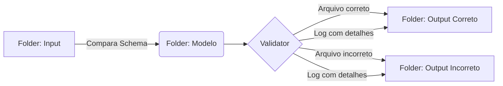
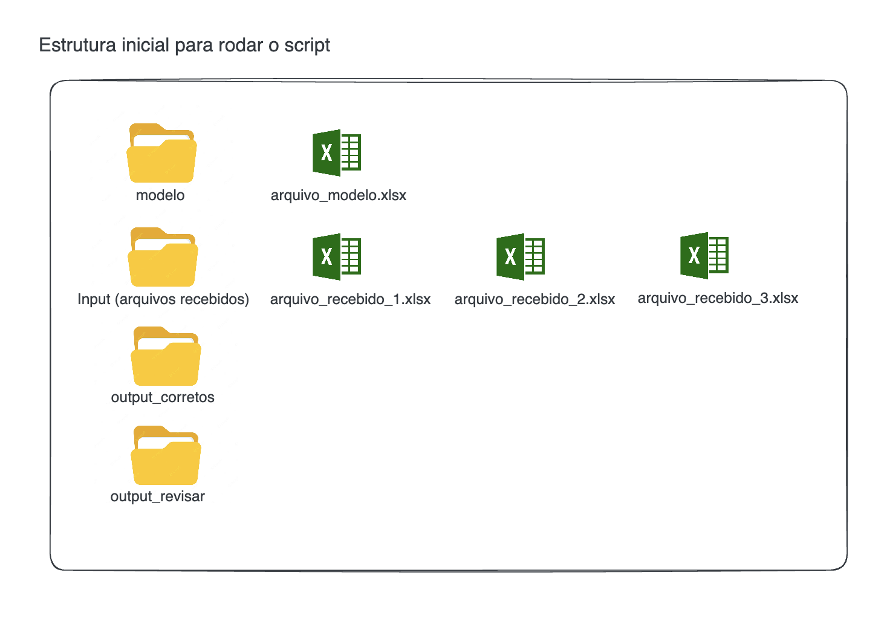
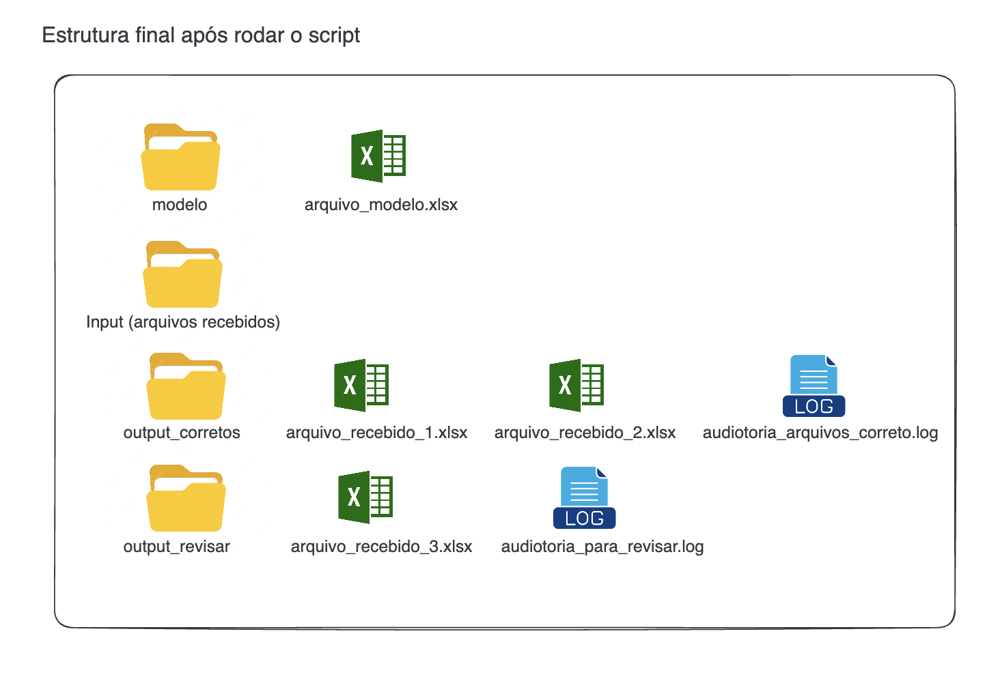

## Descrição

O Excel Structure Validator é um projeto Python destinado a validar a estrutura de arquivos Excel. Ele compara arquivos Excel recebidos com um modelo pré-definido para assegurar que os dados cumpram com os padrões estabelecidos. 

## Fluxo

## Aplicação

O projeto é ideal para cenários onde a qualidade e a consistência dos dados são críticas para análises subsequentes, como importações para o Power BI, análises de dados, entre outros.

Antes de iniciar avalie os arquivos em excel dentro da pasta data/input e data/modelo para entender o comportamento do projeto. Para facilitar, criei arquivos simples com 4 até 6 colunas e poucas linhas, porém o conceito se aplica a qualquer modelo e/ou quantidade de colunas/linhas.

### Antes de rodar o script

### Depois de rodar o script e com o resultado da auditoria

## Validações

São 6 validações que o nosso projeto está configurado

### ::: app.validacoes.colunas_estao_presentes_na_mesma_ordem.validar_se_todas_as_colunas_estao_presentes_na_mesma_ordem

### ::: app.validacoes.colunas_estao_presentes.validar_se_todas_as_colunas_estao_presentes

### ::: app.validacoes.existem_colunas_a_mais.validar_se_existem_colunas_a_mais

### ::: app.validacoes.existem_colunas_a_menos.validar_se_existem_colunas_a_menos

### ::: app.validacoes.quantidade_de_linhas.validar_quantidade_de_linhas

### ::: app.validacoes.tipos_dados.validar_tipos_dados

Caso qualquer validação seja identificada como invalido, ele marca o arquivo como invalido.

## Tabela modelo

O arquivo modelo é o arquivo Excel que deve seguir como template. Ele contém a estrutura que os arquivos Excel recebidos devem seguir. Ele deve ser colocado no diretório `data/modelo/`.

| Coluna A type: Int | Coluna B type: Int | Coluna C type: Int | Coluna D type: Int | Coluna E type: Int |
| ------------------ | ------------------ | ------------------ | ------------------ | ------------------ |
| 44                 | 47                 | 64                 | 67                 | 67                 |
| 9                  | 83                 | 21                 | 36                 | 87                 |
| 70                 | 88                 | 88                 | 12                 | 58                 |
| 65                 | 39                 | 87                 | 46                 | 88                 |
| 81                 | 37                 | 25                 | 77                 | 72                 |
| 9                  | 20                 | 80                 | 69                 | 79                 |
| 47                 | 64                 | 82                 | 99                 | 88                 |
| 49                 | 29                 | 19                 | 19                 | 14                 |
| 39                 | 32                 | 65                 | 9                  | 57                 |
| 32                 | 31                 | 74                 | 23                 | 35                 |

## Folder input

No folder input você encontra 5 arquivos, cada um deles com uma divergencia do Modelo

### Arquivo 1

O arquivo 1 é um arquivo Excel que contém a **estrutura correta.**

| Coluna A type: Int | Coluna B type: Int | Coluna C type: Int | Coluna D type: Int | Coluna E type: Int |
| ------------------ | ------------------ | ------------------ | ------------------ | ------------------ |
| 75                 | 55                 | 28                 | 34                 | 0                  |
| 0                  | 36                 | 53                 | 5                  | 38                 |
| 17                 | 79                 | 4                  | 42                 | 58                 |
| 31                 | 1                  | 65                 | 41                 | 57                 |
| 35                 | 11                 | 46                 | 82                 | 91                 |
| 0                  | 14                 | 99                 | 53                 | 12                 |
| 42                 | 84                 | 75                 | 68                 | 6                  |
| 68                 | 47                 | 3                  | 76                 | 52                 |
| 78                 | 15                 | 20                 | 99                 | 58                 |
| 23                 | 79                 | 13                 | 85                 | 48                 |

### Arquivo 2

O arquivo 2 é um arquivo Excel que contém a estrutura incorreta, **apresenta uma coluna a menos.**

| Coluna A type: Int | Coluna B type: Int | Coluna C type: Int | Coluna D type: Int |
| ------------------ | ------------------ | ------------------ | ------------------ |
| 49                 | 69                 | 41                 | 35                 |
| 64                 | 95                 | 69                 | 94                 |
| 0                  | 50                 | 36                 | 34                 |
| 48                 | 93                 | 3                  | 98                 |
| 42                 | 77                 | 21                 | 73                 |
| 0                  | 10                 | 43                 | 58                 |
| 23                 | 59                 | 2                  | 98                 |
| 62                 | 35                 | 94                 | 67                 |
| 82                 | 46                 | 99                 | 20                 |
| 81                 | 50                 | 27                 | 14                 |

### Arquivo 3

O arquivo 3 é um arquivo Excel que contém a estrutura incorreta, **apresenta uma coluna a mais, coluna f.**

| Coluna A type: Int | Coluna B type: Int | Coluna C type: Int | Coluna D type: Int | Coluna E type: Int | Coluna F type: Int |
| ------------------ | ------------------ | ------------------ | ------------------ | ------------------ | ------------------ |
| 41                 | 58                 | 65                 | 36                 | 10                 | 86                 |
| 43                 | 11                 | 2                  | 51                 | 80                 | 32                 |
| 54                 | 0                  | 38                 | 19                 | 46                 | 42                 |
| 56                 | 60                 | 77                 | 30                 | 24                 | 2                  |
| 3                  | 94                 | 98                 | 13                 | 40                 | 72                 |
| 19                 | 95                 | 72                 | 26                 | 66                 | 52                 |
| 67                 | 61                 | 14                 | 96                 | 4                  | 67                 |
| 11                 | 86                 | 77                 | 75                 | 56                 | 16                 |
| 24                 | 29                 | 21                 | 25                 | 80                 | 60                 |
| 61                 | 83                 | 33                 | 32                 | 70                 | 85                 |

### Arquivo 4

O arquivo 4 é um arquivo Excel que contém a estrutura incorreta, **a ordem das colunas está diferente.**

| Coluna A type: Int | Coluna B type: Int | Coluna C type: Int | Coluna E type: Int | Coluna D type: Int |
| ------------------ | ------------------ | ------------------ | ------------------ | ------------------ |
| 31                 | 13                 | 71                 | 56                 | 24                 |
| 79                 | 41                 | 18                 | 40                 | 54                 |
| 79                 | 11                 | 38                 | 93                 | 1                  |
| 95                 | 44                 | 88                 | 24                 | 67                 |
| 82                 | 3                  | 76                 | 35                 | 86                 |
| 61                 | 69                 | 87                 | 43                 | 32                 |
| 11                 | 84                 | 10                 | 54                 | 37                 |
| 28                 | 2                  | 27                 | 83                 | 89                 |
| 23                 | 53                 | 51                 | 46                 | 20                 |
| 53                 | 29                 | 67                 | 35                 | 39                 |

### Arquivo 5

O arquivo 5 é um arquivo Excel que contém a estrutura incorreta, o número de linhas está diferente. **A linha 12 foi adicionada.**

| Coluna A type: Int | Coluna B type: Int | Coluna C type: Int | Coluna D type: Int | Coluna E type: Int |
| ------------------ | ------------------ | ------------------ | ------------------ | ------------------ |
| 9                  | 73                 | 41                 | 23                 | 3                  |
| 46                 | 90                 | 50                 | 3                  | 31                 |
| 9                  | 10                 | 27                 | 45                 | 71                 |
| 39                 | 61                 | 85                 | 97                 | 44                 |
| 34                 | 34                 | 88                 | 33                 | 5                  |
| 36                 | 0                  | 75                 | 34                 | 69                 |
| 53                 | 80                 | 62                 | 8                  | 61                 |
| 1                  | 81                 | 35                 | 91                 | 40                 |
| 36                 | 48                 | 25                 | 67                 | 35                 |
| 66                 | 43                 | 24                 | 4                  | 12                 |
| 30                 | 29                 | 33                 | 18                 | 17                 |
